### Hey, I'm Ayato

I build web applications end to end — the interface people click, the API behind it,
and the database underneath. I care more about software that holds up in production
than software that demos well.

Most of what I build ships in Arabic, right-to-left. That constraint is the reason I
pay attention to typography, layout direction, and font loading long before anyone
asks me to.

 

### Kholasat El-English — an Arabic learning platform

**[ayato2x.github.io/kholasat-english-platform](https://ayato2x.github.io/kholasat-english-platform/)** &nbsp;·&nbsp; [how it was built](https://github.com/ayato2x/kholasat-english-platform)

A complete front end for a secondary-school English platform: public site, student
area, parent area, admin panel. 37 screens, 4 roles, fully right-to-left.

The hero is a real 3D book — hinged leaves on a spine — that **closes as you scroll**.
The rest of the site is laid out like a printed course book rather than a landing-page
template: masthead rules, hanging section numbers, type set flush to the margin.

It is a design prototype. The teacher's name and photos are real; the prices,
timetables and reviews in it are invented, and the site says so on every page.

Three things I learned the hard way building it, all of them measured rather than guessed:

- **An animation can wreck your Largest Contentful Paint.** The headline paragraph
  started at `opacity: 0` with a `1.05s` delay. The browser does not count an element
  as painted until it is actually visible, so most of a 2.79 s LCP was self-inflicted.
  Sliding it in instead of fading it fixed it.
- **Dropped frames on mouse move were never JavaScript.** The handlers cost 0.05 ms.
  The custom cursor used `mix-blend-mode: difference`, which forces the compositor to
  re-blend the entire page underneath it on every pointer move — over a 3D book and a
  full-screen gradient. Removing the blend removed the problem.
- **Framer Motion hands scroll-linked opacity to the Web Animations API.** It scrubs
  that animation by `currentTime` — except it was left `playState: "running"`, so it
  advanced on its own clock and faded text back in as you scrolled down. I now write
  scroll-linked styles straight to the node.

 

 

<b>What I actually reach for, and why</b>

 

| Layer | Tools | Why |
|---|---|---|
| **Interface** | React, TypeScript, Tailwind | Components stay honest when types stop me guessing what a prop holds. |
| **API** | Node, Express | One language across the stack. Less context switching, faster iteration. |
| **Data** | MongoDB, Mongoose | Flexible schemas while requirements are still moving. |
| **Auth** | JWT, bcrypt | Tokens with real expiry, passwords never stored in plain text. |
| **Ship it** | Vercel, Render, Atlas | Every project gets a live URL. Code nobody can click doesn't count. |

Not on this list: anything I've only read a tutorial about.

<b>How I work</b>

 

- **Schema before syntax.** I map the data model before writing routes. Changing a schema in week three is expensive; changing it on paper is free.
- **Errors are a feature.** Loading states, empty states, and failure states get built alongside the happy path, not bolted on after.
- **Measure, then fix.** Every performance claim above came from the browser's own numbers. Guessing at a bottleneck usually means optimising the wrong thing.
- **Small commits, real messages.** `add token refresh on 401` tells a story. `update` tells nothing.
- **Deployed or it didn't happen.** Every project ends with a URL, not a zip file.

<b>What I'm learning next</b>

 

- **TypeScript on the backend** — same safety I get in React, applied to routes and models
- **Docker** — so "works on my machine" stops being a sentence I say
- **System design** — caching, rate limiting, and what actually breaks under load

 

### Projects

| Project | What it does | Stack |
|---|---|---|
| **[Kholasat El-English](https://ayato2x.github.io/kholasat-english-platform/)** | Arabic RTL learning platform — 37 screens, 4 roles, scroll-driven 3D hero | React · TypeScript · Tailwind |
| _in progress_ | Task manager with real auth — accounts, sessions, per-user data | React · Express · MongoDB |
| _planned_ | Real-time chat over WebSockets | Node · Socket.IO |

 

### Reach me

Open an issue on any repo, or find me through the links on my profile.

Open to collaborating on open-source — if you maintain something and need hands, say hi.
