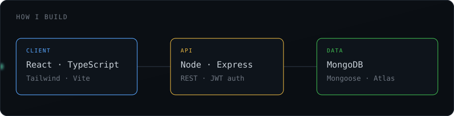

### Hey, I'm Ayato

I build web applications end to end — the interface people click, the API behind it,
and the database underneath. I care more about software that holds up in production
than software that demos well.

Right now I'm deepening my backend work: authentication done properly, APIs that fail
gracefully, and schemas designed before the first line of code.

 

 

 

<b>What I actually reach for, and why</b>

 

| Layer | Tools | Why |
|---|---|---|
| **Interface** | React, TypeScript, Tailwind | Components stay honest when types stop me guessing what a prop holds. |
| **API** | Node, Express | One language across the stack. Less context switching, faster iteration. |
| **Data** | MongoDB, Mongoose | Flexible schemas while requirements are still moving. |
| **Auth** | JWT, bcrypt | Tokens with real expiry, passwords never stored in plain text. |
| **Ship it** | Vercel, Render, Atlas | Every project gets a live URL. Code nobody can click doesn't count. |

Not on this list: anything I've only read a tutorial about.

<b>How I work</b>

 

- **Schema before syntax.** I map the data model before writing routes. Changing a schema in week three is expensive; changing it on paper is free.
- **Errors are a feature.** Loading states, empty states, and failure states get built alongside the happy path, not bolted on after.
- **Small commits, real messages.** `add token refresh on 401` tells a story. `update` tells nothing.
- **Deployed or it didn't happen.** Every project ends with a URL, not a zip file.

<b>What I'm learning next</b>

 

- **TypeScript on the backend** — same safety I get in React, applied to routes and models
- **Docker** — so "works on my machine" stops being a sentence I say
- **System design** — caching, rate limiting, and what actually breaks under load

 

### Projects

Building these now — each one deployed with a live link when it lands.

| Project | What it does | Stack |
|---|---|---|
| _in progress_ | Task manager with real auth — accounts, sessions, per-user data | React · Express · MongoDB |
| _planned_ | API-driven dashboard with proper loading and error states | React · REST |
| _planned_ | Real-time chat over WebSockets | Node · Socket.IO |

 

### Reach me

Open an issue on any repo, or find me through the links on my profile.

Open to collaborating on open-source — if you maintain something and need hands, say hi.
